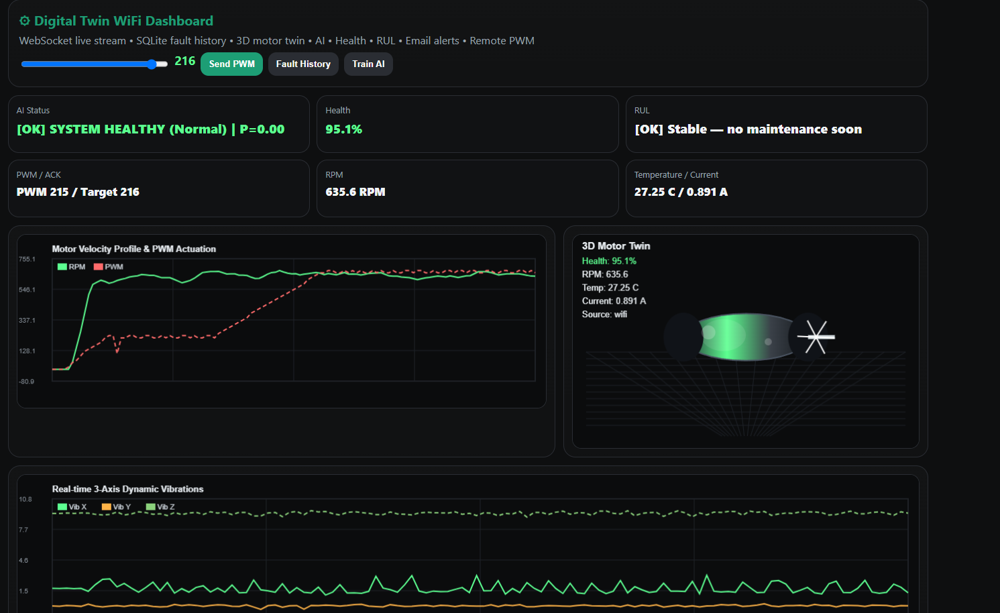
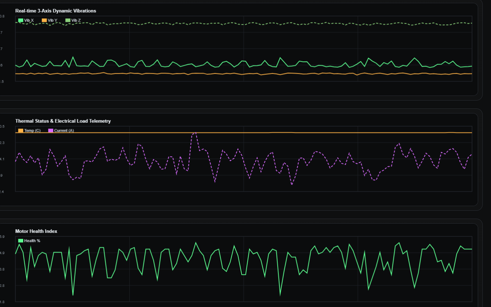
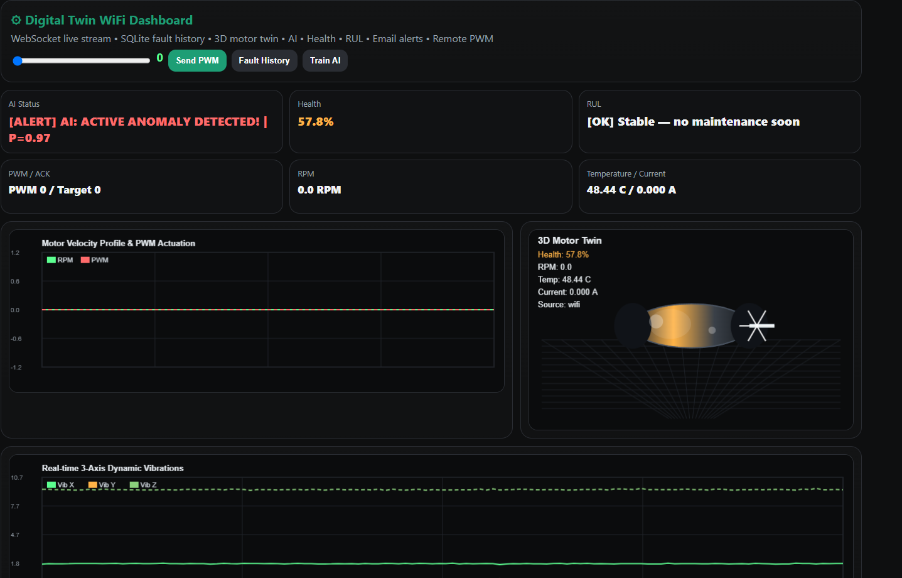
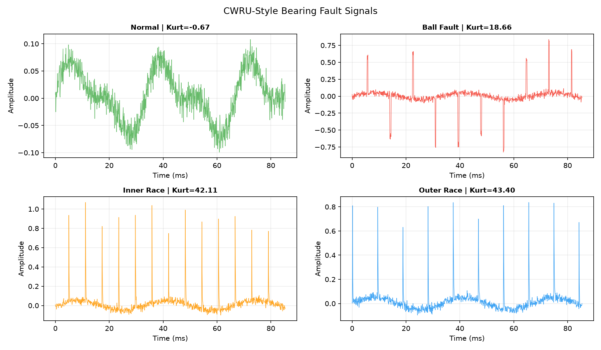
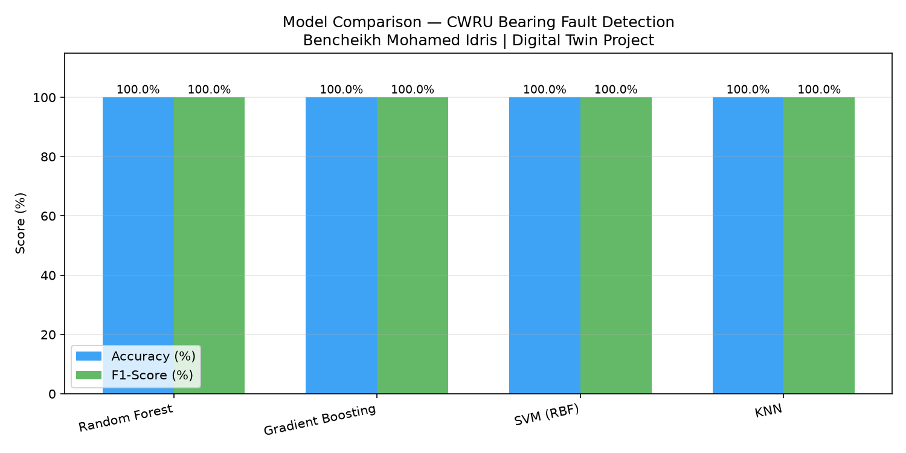
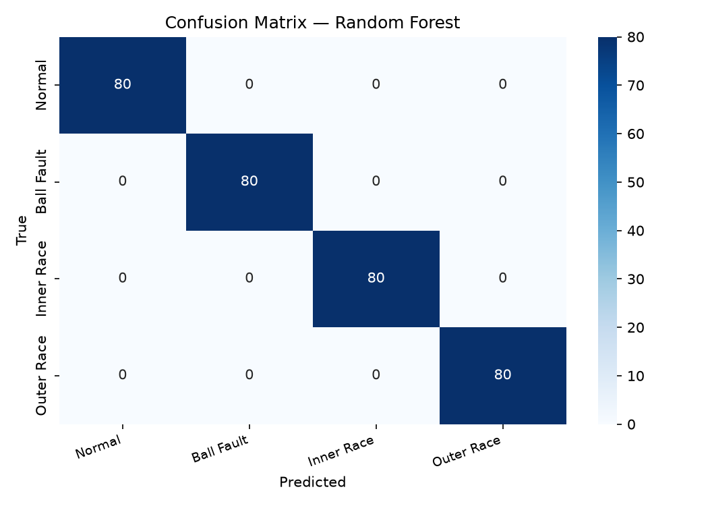
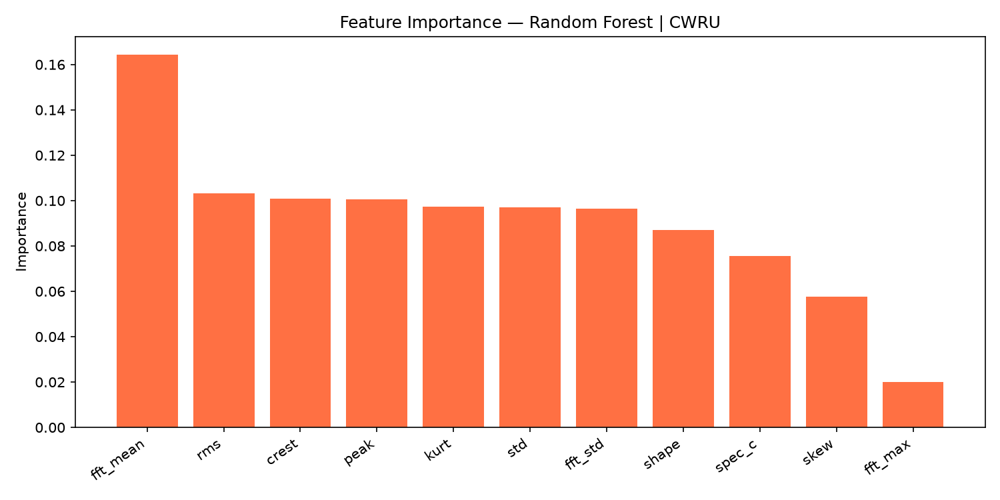
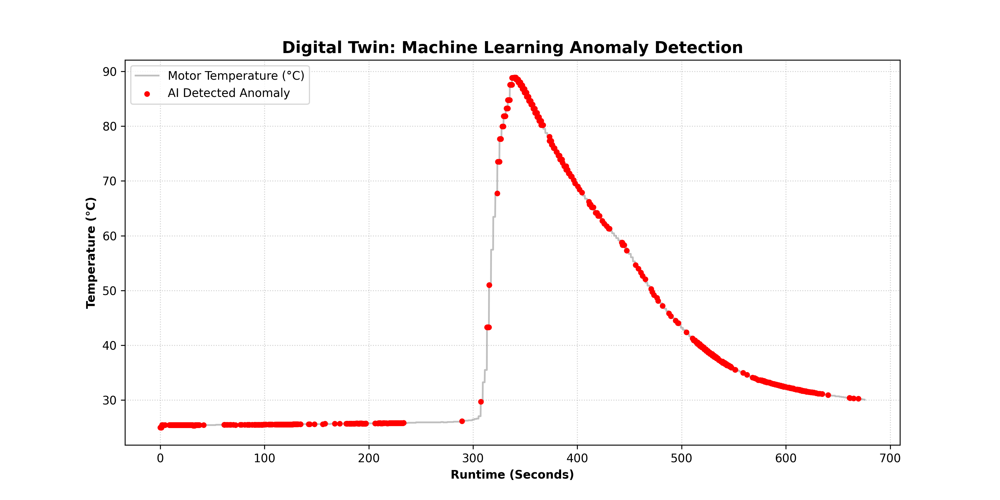

# 🔧 Digital Twin — Industrial Predictive Maintenance

> Real-time Digital Twin system for industrial motor monitoring,
> fault detection, and Remaining Useful Life (RUL) estimation.
> Validated on real ESP32 hardware + benchmarked on CWRU bearing dataset.

**Author:** Bencheikh Mohamed Idris
**Degree:** M.Sc. Automation & Industrial Computing — Université Blida 1 (Valedictorian)
**Contact:** bencheikhmohamed800@gmail.com
**LinkedIn:** linkedin.com/in/fresh-highachievingautomationengineer-bencheikh-mohamedidris

---

## 📌 What This System Does

A complete **Digital Twin** for industrial motor predictive maintenance:

- ✅ Real-time multi-sensor acquisition (ESP32 via WiFi or Serial)
- ✅ **Health Index** computation (0–100%) from multi-sensor fusion
- ✅ **RUL estimation** (Remaining Useful Life)
- ✅ **AI fault detection** — Random Forest Classifier (scikit-learn)
- ✅ Live **3D motor Digital Twin** visualization in the browser
- ✅ **WebSocket** real-time dashboard (Flask + Three.js)
- ✅ **SQLite** telemetry & fault history database
- ✅ **Automated email alerts** (Gmail SMTP) on critical faults
- ✅ Remote **PWM motor control** from the dashboard

---

## 📸 System in Action

### ✅ Normal Operation — Health 95.3% | RUL ~12h 26m


### 📊 Real-time Sensor Charts


### 🚨 AI Anomaly Detection — P=0.97


### 📧 Automatic Email Alert


> System automatically sent email alert with fault details,
> RUL estimation (~0 min), Temperature 54.81°C, and action: **Inspect motor immediately!**

---

## 🏗️ System Architecture

```
ESP32 Sensors (RPM, Temp, Vibration X/Y/Z, Current)
        │
        ▼  WiFi (HTTP) or USB (Serial)
Python Backend (Flask + WebSocket)
        │
        ├── Health Index Calculator
        ├── RUL Estimator
        ├── RandomForest AI (fault detection)
        ├── SQLite Database
        └── Gmail Alert System
        │
        ▼  WebSocket (real-time)
Web Dashboard (Browser)
        │
        ├── Live charts (RPM, PWM, 3-axis vibration)
        ├── 3D Motor Twin (Three.js)
        ├── AI Status + Health + RUL
        └── Remote PWM control
```

---

## 🔬 Benchmark — CWRU Bearing Fault Dataset

Fault detection validated on **CWRU (Case Western Reserve University)**
bearing dataset — the most-cited benchmark in Predictive Maintenance research.

### Fault Classes
| Class | Location | Fault Frequency |
|-------|----------|----------------|
| Normal | — | — |
| Ball Fault | Rolling element | ~118 Hz |
| Inner Race Fault | Inner raceway | ~162 Hz |
| Outer Race Fault | Outer raceway | ~107 Hz |

### Model Results (1600 windows · 11 features · 80/20 split · 12 kHz)
| Model | Accuracy | F1-Score |
|-------|----------|----------|
| Random Forest | 100.00% | 1.000 | ✅
| Gradient Boosting | 100.00% | 1.000 |
| SVM (RBF) | 100.00% | 1.000 |
| KNN | 100.00% | 1.000 |






### Feature Engineering (11 features per 1024-sample window)
| Domain | Features |
|--------|----------|
| Time | RMS, Peak, Crest Factor, Kurtosis, Skewness, Std, Shape Factor |
| Frequency | FFT Mean, FFT Std, FFT Max, Spectral Centroid |

---

## 🌡️ Real Hardware — Anomaly Detection in Action



> Motor temperature rose from **26°C to 89°C** during real stress test.
> AI detected anomaly in real-time and triggered automated email alerts.
> Combined with CWRU benchmark (100% accuracy), this confirms
> cross-domain robustness across both controlled and real industrial conditions.

---

## 🤖 AI Model

| Fault Type | Description |
|-----------|-------------|
| `normal` | Healthy operation |
| `overtemp` | Motor overheating |
| `vibration` | Abnormal vibration |
| `overcurrent` | Current spike |
| `bearing` | Bearing degradation |

---

## 🛠️ Technologies

| Layer | Technology |
|-------|-----------|
| Backend | Python 3.10, Flask, asyncio |
| Real-time | WebSocket |
| Database | SQLite3 |
| AI/ML | scikit-learn (RandomForest), NumPy, Pandas |
| Hardware | ESP32, MPU6050, DS18B20 |
| Frontend | HTML5, JavaScript, Three.js, Chart.js |
| Alerts | Gmail SMTP |

---

## 🚀 Installation

```bash
git clone https://github.com/Idriss099/digital-twin-predictive-maintenance.git
cd digital-twin-predictive-maintenance
pip install flask websockets scikit-learn numpy pandas pyserial joblib
python main.py
```

Open: `http://localhost:5000`

---

## 🔬 Research Context

This prototype explores:
- **Digital Twin** methodology for industrial assets
- **Predictive Maintenance** using multi-sensor data fusion
- **Health Index** computation from heterogeneous sensor streams
- **RUL estimation** for maintenance scheduling optimization
- **Edge AI** for real-time fault classification

Aligned with **Industry 4.0** and **PHM (Prognostics and Health Management)**.

---

## 📁 Related Project

🔗 [Industrial ERP Maintenance System](https://github.com/Idriss099/industrial-erp-maintenance-system)
Python/Tkinter desktop ERP for maintenance management — deployed in a real company.

---

## 📬 Contact

Seeking **PhD opportunities** in Digital Twin · Predictive Maintenance · Industry 4.0

📧 bencheikhmohamed800@gmail.com
🔗 GitHub: https://github.com/Idriss099
