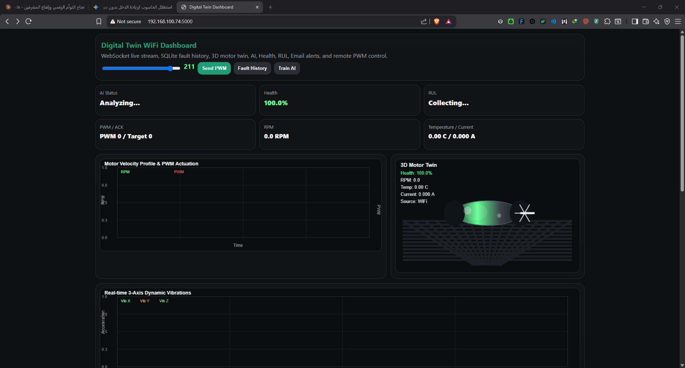
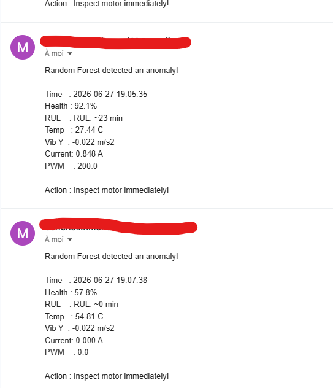

# 🔧 Digital Twin — Industrial Predictive Maintenance

> Real-time Digital Twin system for industrial motor monitoring,  
> fault detection, and remaining useful life (RUL) estimation.

**Author:** Bencheikh Mohamed Idris  
**Background:** M.Sc. Automation & Industrial Computing — Université Blida 1 (Valedictorian)  
**Contact:** bencheikhmohamed800@gmail.com

---

## 📌 What This System Does

This project implements a complete **Digital Twin** for an industrial motor, combining:

- ✅ Real-time sensor data acquisition (ESP32 via WiFi or Serial)
- ✅ **Health Index** computation (0–100%) from multi-sensor fusion
- ✅ **RUL estimation** (Remaining Useful Life)
- ✅ **AI fault detection** using Random Forest Classifier (scikit-learn)
- ✅ 3D motor visualization in the browser
- ✅ WebSocket live dashboard (Flask + JS)
- ✅ SQLite telemetry & fault history database
- ✅ Automated email alerts (Gmail SMTP) on critical faults
- ✅ Remote PWM motor control from the dashboard

---

## 🏗️ System Architecture

```
ESP32 Sensors (RPM, Temp, Vibration X/Y/Z, Current)
        │
        ▼ WiFi (HTTP) or USB (Serial)
        │
Python Backend (Flask + WebSocket Server)
        │
        ├── Health Index Calculator
        ├── RUL Estimator  
        ├── RandomForest AI Model (fault detection)
        ├── SQLite Database (telemetry + faults)
        └── Email Alert System
        │
        ▼ WebSocket (real-time)
        │
Web Dashboard (Browser)
        │
        ├── Live charts (RPM, PWM, Vibration 3-axis)
        ├── 3D Motor Twin (Three.js)
        ├── AI Status + Health + RUL display
        └── Remote PWM control slider
```

---

## 📊 Dashboard Preview



**Key metrics displayed in real-time:**
- Motor Health Index: 0–100%
- AI Fault Detection Status
- RPM & PWM control
- 3-Axis vibration (X, Y, Z)
- Temperature & Current consumption
- Remaining Useful Life (RUL)
- Fault history log

---

## 🤖 AI Model

The system uses a **Random Forest Classifier** trained on labeled fault data:

| Fault Type | Description |
|-----------|-------------|
| `normal` | Healthy operation |
| `overtemp` | Motor overheating |
| `vibration` | Abnormal vibration detected |
| `overcurrent` | Current spike |
| `bearing` | Bearing degradation |

Training data format (`fault_training_data.csv`):
```
rpm, vib_x, vib_y, vib_z, temp, current, label
1200, 0.12, 0.08, 9.85, 45.2, 1.23, normal
800, 2.45, 1.87, 11.2, 78.5, 2.89, overtemp
```

---

## 🛠️ Technologies Used

| Layer | Technology |
|-------|-----------|
| Backend | Python 3.10, Flask, asyncio |
| Real-time | WebSocket (websockets library) |
| Database | SQLite3 |
| AI/ML | scikit-learn (RandomForest), NumPy, Pandas |
| Hardware | ESP32, MPU6050 (vibration), DS18B20 (temp) |
| Frontend | HTML5, JavaScript, Three.js (3D), Chart.js |
| Alerts | Gmail SMTP |

---

## 🚀 Installation

```bash
# Clone the repository
git clone https://github.com/Idriss099/digital-twin-predictive-maintenance.git
cd digital-twin-predictive-maintenance

# Install dependencies
pip install flask websockets scikit-learn numpy pandas pyserial joblib python-dotenv

# Configure environment
cp .env.example .env
# Edit .env with your Gmail credentials

# Run the system
python main.py
```

Open your browser at: `http://localhost:5000`

---

## 🔬 Research Context

This project is a **proof-of-concept prototype** exploring:

- **Digital Twin** methodology for industrial assets
- **Predictive Maintenance** using multi-sensor data fusion
- **Health Index** computation from heterogeneous sensor streams
- **Edge AI** deployment for real-time fault classification
- **RUL estimation** for maintenance scheduling optimization

These topics align with **Industry 4.0** and **PHM (Prognostics and Health Management)** research domains.

---

## 📁 Related Projects

- [ERP Maintenance Management System](link) — Python/Tkinter desktop application for industrial maintenance tracking, built for SARL Kadri Ascenseurs. Features: inventory management, contract tracking, invoice generation, user authentication.

---

## 📬 Contact

I am actively seeking **PhD opportunities** in:
- Digital Twin for industrial systems
- Predictive Maintenance & PHM
- Industry 4.0 / Cyber-Physical Systems

  ## 📸 System in Action

### ✅ Normal Operation — Health 95.1%


### 📊 Real-time Sensor Charts


### 🚨 AI Anomaly Detection — P=0.97


### 📧 Automatic Email Alert

> System automatically sent email alert with fault details,
> RUL estimation (~0 min), and recommended action.

**Email:** bencheikhmohamed800@gmail.com  
**LinkedIn:** linkedin.com/in/fresh-highachievingautomationengineer-bencheikh-mohamedidris

## 🔬 Benchmark — CWRU Bearing Fault Dataset


|
 Model 
|
 Accuracy 
|
 F1-Score 
|
|
-------
|
----------
|
----------
|
|
 Random Forest 
|
 100.00% 
|
 1.000 
|
 ✅
|
 Gradient Boosting 
|
 100.00% 
|
 1.000 
|
|
 SVM (RBF) 
|
 100.00% 
|
 1.000 
|
|
 KNN 
|
 100.00% 
|
 1.000 
|


## 🌡️ Real Hardware — Anomaly Detection in Action


> Motor temperature rose from 26°C to 89°C.
> AI detected anomaly in real-time and triggered automated alerts.
